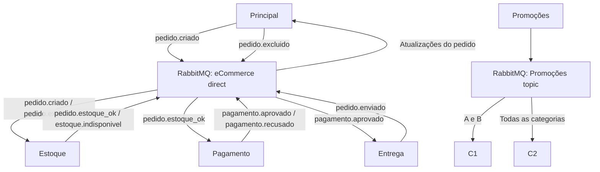

# Trabalho 2 — E-commerce com eventos e assinatura digital

Backend acadêmico para a disciplina de Sistemas Distribuídos da UTFPR. Cinco microsserviços independentes e dois consumidores de promoções comunicam-se exclusivamente pelo RabbitMQ. A interface é um menu de terminal.

## Preparação

Requisitos: Python 3.12 e Docker Desktop executando contêineres Linux. No Windows, o Docker pode exigir WSL 2 e uma reinicialização. Execute os comandos abaixo **dentro de `trabalho_2`**, usando PowerShell.

```powershell
py -3.12 -m venv .venv
.\.venv\Scripts\python.exe -m pip install -r requirements.txt
.\.venv\Scripts\python.exe -m scripts.gerar_chaves
```

Se o Python estiver instalado sem o comando `py`, substitua `py -3.12` pelo caminho do seu `python.exe`. Não é necessário ativar o ambiente virtual.

O gerador cria uma chave privada RSA de 2048 bits por microsserviço e copia as chaves públicas para a pasta `chaves/publicas` de cada serviço. Os consumidores recebem a chave pública de Promoções. Executá-lo novamente preserva as chaves privadas existentes. Gere chaves com os processos parados. Chaves geradas são ignoradas pelo Git.

## Executar a demonstração

Com Docker Desktop aberto:

```powershell
powershell -ExecutionPolicy Bypass -File .\scripts\iniciar.ps1
```

O script inicia RabbitMQ, prepara as chaves, limpa as filas de uma sessão anterior e abre sete terminais. Ele se recusa a limpar filas com consumidores ativos; encerre **todos** os processos da sessão anterior, inclusive Promoções, antes de executá-lo novamente.

No terminal Principal, informe um nome de cliente. O menu permite listar produtos, criar pedidos, excluir pedidos e consultar os pedidos desse cliente. Para criar, informe os itens no formato `1:2,2:1` (duas unidades do produto 1 e uma do produto 2). A consulta mostra os IDs completos usados na exclusão.

O catálogo inicial contém Caderno (A, R$ 15,00), Camiseta (B, R$ 50,00) e Fone (C, R$ 80,00), com dez unidades de cada produto. A disponibilidade é verificada pelo Estoque após o pedido; o catálogo do menu não mostra saldo em tempo real. Todos os valores monetários são inteiros em centavos.

Para demonstrar aprovação ou recusa de forma previsível:

```powershell
# Encerre todos os processos entre as execuções.
powershell -ExecutionPolicy Bypass -File .\scripts\iniciar.ps1 -ProbAprovacao 1
powershell -ExecutionPolicy Bypass -File .\scripts\iniciar.ps1 -ProbAprovacao 0
```

O padrão é probabilidade de aprovação de 0,5 e uma promoção a cada cinco segundos. As promoções escolhem produtos e descontos de 10%, 20% ou 30% aleatoriamente; são notificações, sem alteração do preço do catálogo de pedidos.

### Execução manual

Prepare a infraestrutura uma vez, com os processos da aplicação parados:

```powershell
docker compose up -d --wait
.\.venv\Scripts\python.exe -m scripts.gerar_chaves
.\.venv\Scripts\python.exe -m scripts.preparar_filas --limpar
```

Execute cada linha em um terminal diferente, dentro de `trabalho_2`:

```powershell
.\.venv\Scripts\python.exe -u -m estoque
.\.venv\Scripts\python.exe -u -m pagamento
.\.venv\Scripts\python.exe -u -m entrega
.\.venv\Scripts\python.exe -u -m consumidores c1
.\.venv\Scripts\python.exe -u -m consumidores c2
.\.venv\Scripts\python.exe -u -m promocoes
.\.venv\Scripts\python.exe -u -m principal
```

Variáveis opcionais: `PROB_APROVACAO` (0 a 1), `INTERVALO_PROMOCOES` (segundos positivos) e `RABBITMQ_URL`. A conexão padrão usa o usuário de demonstração `guest` em `localhost:5672`; as portas do Compose ficam vinculadas somente a `127.0.0.1`. O painel fica em [localhost:15672](http://localhost:15672), com usuário e senha `guest`.

Para encerrar: saia do Principal com `0`, interrompa os outros seis processos com Ctrl+C e execute `docker compose down`. Esse comando encerra e remove apenas a infraestrutura deste Compose.

## Arquitetura

| Processo | Consome | Publica |
| --- | --- | --- |
| Principal | `pedido.estoque_ok`, `estoque.indisponivel`, `pagamento.aprovado`, `pagamento.recusado`, `pedido.enviado` | `pedido.criado`, `pedido.excluido` |
| Estoque | `pedido.criado`, `pedido.excluido` | `pedido.estoque_ok`, `estoque.indisponivel` |
| Pagamento | `pedido.estoque_ok` | `pagamento.aprovado`, `pagamento.recusado` |
| Entrega | `pagamento.aprovado` | `pedido.enviado` |
| Promoções | — | `promocao.categoria.A`, `.B`, `.C` |
| C1 | Promoções de A e B | — |
| C2 | Promoções de todas as categorias | — |



A exchange `eCommerce` é `direct`: cada fila possui os bindings exatos da tabela. A exchange `Promoções` é `topic`: `promocoes.c1` usa `promocao.categoria.A` e `promocao.categoria.B`; `promocoes.c2` usa `promocao.categoria.*`. As outras filas chamam-se `principal`, `estoque`, `pagamento` e `entrega`.

São seis filas próprias, nomeadas, não exclusivas, não duráveis e sem exclusão automática quando um consumidor sai. As mensagens são transitórias. Não é usada exchange `fanout`. Cada publicação chega a todas as filas cujo binding corresponde à routing key.

O Principal usa uma thread para receber eventos e outra para o menu, cada uma com sua própria conexão Pika. Um lock protege os pedidos. Os outros serviços consomem sequencialmente. Nenhum serviço consulta outro processo ou compartilha estado mutável. O módulo comum contém apenas catálogo inicial, mensageria e criptografia.

### Contrato e assinatura

O envelope JSON contém:

```json
{
  "event_id": "UUID único do evento",
  "producer": "principal",
  "event_type": "pedido.criado",
  "data": {
    "pedido_id": "UUID do pedido",
    "cliente": "Ana",
    "itens": [{"produto_id": "1", "quantidade": 2, "nome": "Caderno", "preco_unitario_centavos": 1500}],
    "total_centavos": 3000
  },
  "Signature": "assinatura codificada em Base64"
}
```

`pedido.estoque_ok` e os resultados do pagamento transportam os dados do pedido. Exclusões e indisponibilidade levam `pedido_id` e motivo; o envio leva `pedido_id` e `nota_id`. Promoções levam produto, categoria, preço e desconto.

Todo o envelope, exceto `Signature`, é serializado em UTF-8 com chaves ordenadas e separadores fixos. Calcula-se SHA-256 e assina-se com RSA/PKCS#1 v1.5 usando a chave privada do produtor. O consumidor verifica a assinatura com uma chave pública local, confere o produtor permitido para aquele evento e a correspondência entre tipo e routing key. Só então executa a lógica. Isso garante autenticidade e integridade; o conteúdo não é cifrado.

Mensagens inválidas são descartadas com `basic_reject(requeue=False)`. Mensagens válidas são confirmadas manualmente após o processamento e a publicação de seus resultados. Confirmações de publicação detectam falhas na entrega ao broker; não fornecem uma transação distribuída. Eventos repetidos são reconhecidos pelo `event_id` durante a sessão, e Estoque, Pagamento e Entrega também evitam repetir operações por `pedido_id`.

## Regras e limites da implementação

- O Estoque reserva somente se **todos** os itens estiverem disponíveis. A exclusão devolve apenas a reserva registrada, no máximo uma vez. Uma exclusão anterior à criação impede reserva posterior.
- O Principal mantém os estados criado, estoque reservado, pagamento aprovado, enviado e excluído. Falta de estoque ou pagamento recusado provoca exclusão automática. Eventos atrasados não reativam um pedido excluído nem fazem um enviado retroceder.
- **Exclusão manual é lógica**, conforme a decisão de escopo: marca como excluído, publica `pedido.excluido` e devolve eventual reserva. É permitida inclusive depois do envio. Não há estorno nem garantia de interromper Pagamento/Entrega já em andamento. Em uma aplicação real, devolver estoque após envio exigiria outra regra de negócio; essa coordenação está fora deste trabalho.
- A nota é um registro simulado em memória, com número, itens, cliente e total, impresso no terminal. Não é uma nota fiscal real, nem há integração com transportadora.
- Dados, reservas, notas e controle de duplicatas ficam em memória. O nome do cliente serve apenas para identificar pedidos na demonstração, sem autenticação.
- Após falha ou reinício de qualquer processo, encerre todos e comece uma sessão limpa. Não há recuperação parcial, reconexão automática, persistência ou garantia de processamento exatamente uma vez diante de falhas.
- O heartbeat AMQP está desativado nesta demonstração local para permitir que o publicador do menu aguarde entrada do usuário sem manter um loop adicional de rede.

## Testes e roteiro da defesa

Testes de regras e assinatura, sem RabbitMQ:

```powershell
.\.venv\Scripts\python.exe -m unittest discover -s tests -v
```

Teste de integração com broker real, iniciando os processos Python automaticamente. **Encerre todos os serviços antes**: o teste limpa as seis filas da aplicação entre cenários.

```powershell
docker compose up -d --wait
.\.venv\Scripts\python.exe -m scripts.teste_integracao
```

O teste verifica aprovação até envio, consumo enquanto o menu espera entrada, exclusão manual, indisponibilidade, recusa com devolução, assinatura inválida, publicação repetida e roteamento A/B/C entre C1 e C2. Para um broker fora do Compose, configure `RABBITMQ_URL` apontando para uma instância dedicada à demonstração.

### Validação da primeira entrega — 09/09/2026

- 16 testes de regras e criptografia passaram em Python 3.12.10.
- Geração das chaves, compilação dos módulos, sintaxe dos scripts PowerShell e configuração do Compose foram verificadas.
- O teste de integração foi tentado, mas não executou cenários: o Docker Desktop instalado não iniciou o motor porque a Plataforma de Máquina Virtual do Windows está desativada e o WSL não está disponível. Não havia broker na porta 5672.
- **Pendente:** habilitar a Plataforma de Máquina Virtual e preparar WSL 2 com privilégios de administrador, reiniciar o Windows se solicitado e executar o teste de integração acima. A integração completa ainda não está validada nesta entrega.

Na defesa, demonstre:

1. Sessão com aprovação de 100%: crie `1:2`, aguarde envio e consulte o pedido.
2. Na mesma sessão, crie `1:11`: mostre indisponibilidade e exclusão sem reserva parcial.
3. Exclua o primeiro pedido e mostre a devolução única no Estoque, explicando a exclusão lógica.
4. Reinicie a sessão com aprovação de 0%: mostre recusa e devolução da reserva.
5. Observe promoções nos dois consumidores: C1 recebe A/B; C2 também recebe C.
6. Execute o teste de integração: mostre o descarte da mensagem adulterada e o processamento da válida.
7. Explique as exchanges, filas independentes, chaves públicas/privadas e o campo `Signature`.

O enunciado prevê desenvolvimento em dupla e defesa obrigatória.

Referências: [RabbitMQ — Routing](https://www.rabbitmq.com/tutorials/tutorial-four-python), [RabbitMQ — Topics](https://www.rabbitmq.com/tutorials/tutorial-five-python) e [PyCryptodome — assinatura RSA](https://pycryptodome.readthedocs.io/en/latest/src/signature/pkcs1_v1_5.html).
